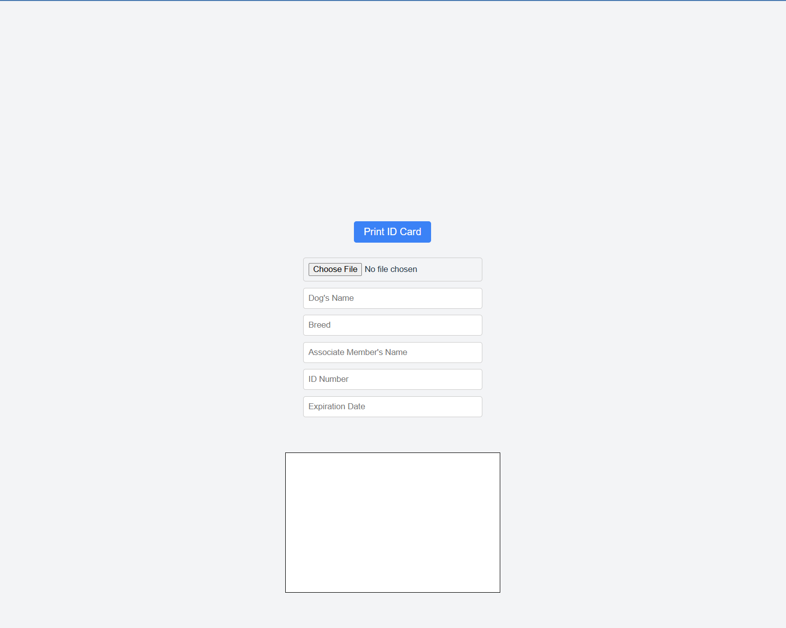

# Dog ID Template App
## Description:
(Front-End, React.js) | Web app that is designed to allow users to input specific information, then print it in the appropriate location on a custom ID card 8x11 sheet of paper.

## Deployment Link:
https://fenrir-id.surge.sh/

## Screenshots:

## Technologies Used:
#### Front-End:
- HTML
- CSS
- React.js
#### Back-End:
- None
#### Build Tools, Packages, and Installs:
- Vite
#### Version Control:
- Git
- GitHub
#### Editor:
- VS Code Editor

## References:
#### Development Environment:
//

#### Deployment:
// 

#### Deployment Troubleshooting:
// 

#### Information References:
// 

#### Images References / Credits:
// https://thenounproject.com/icon/wolf-7259859/

#### Sounds References / Credits:
//

#### Fonts / Credits:
// 
